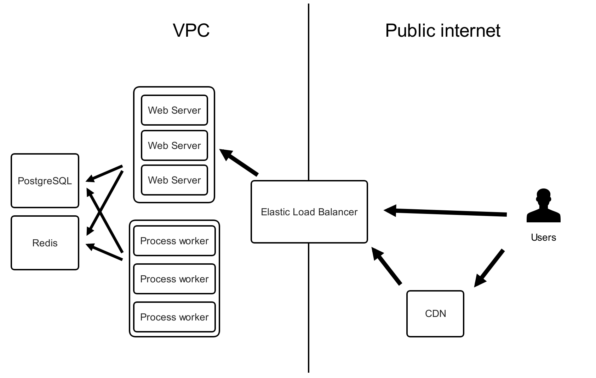

Screendoor Federal Security Documentation
----

This repository is a collection of security documentation that is intended to support the signing of an Authority to Operate (ATO). This documentation is for the cloud-hosted version of Screendoor, although much of it will be pertinent to an on-premises installation as well.

Screendoor has not gone through the full FedRAMP authorization process. Obtaining a full FedRAMP authorization is currently an 18-24 month process, and comes at a cost that is fully prohibitive to an organization of our size. However, we are hosted on Amazon Web Services (AWS), a FedRAMP Compliant CSP, and we have gathered the necessary documentation in support of a ["Lightweight ATO"](https://gsablogs.gsa.gov/innovation/2014/12/10/it-security-security-in-an-agile-development-cloud-world-by-kurt-garbars/) as defined by GSA.

## What is Screendoor?

Screendoor is a cloud-based application that allows government users to build forms, collect responses from the public, and define workflows to manage those incoming responses. It supports a variety of use cases, such as RFP submission and scoring, innovation challenges, fellowship applications, and more. Screendoor is built by the Department of Better Technology (DOBT), a startup founded by former Presidential Innovation Fellows.

## How is Screendoor built, and how does it store information?

Screendoor is a Ruby on Rails application that is hosted in the AWS US-Oregon region. Internally, all network traffic occurs within Amazon's Virtual Private Cloud. All traffic to the public internet occurs over encrypted protocols such as `https` and `wss`.

<!-- generated via https://moqups.com/#!/edit/adamjacobbecker/rZf5xfry -->

## FISMA Categorization

The majority of Screendoor's federal customers are categorized as FISMA Low, since they do not collect PII as per [GSA's definition](https://pages.18f.gov/before-you-ship/security/pii/).

## Static scans

Screendoor is continuously scanned with Brakeman, a static code analysis tool for Ruby on Rails.

[View Screendoor's static scan report &rarr;](Static Scans)

## Dynamic scans

Screendoor's most recently dynamic scan was performed with HP Fortify On Demand.

[View Screendoor's dynamic scan report &rarr;](Dynamic Scans)

## System security plan

We have documented our compliance with the 24 NIST controls that are part of a "Lightweight ATO process", [as described by GSA CISO Kurt Gabars](https://gsablogs.gsa.gov/innovation/2014/12/10/it-security-security-in-an-agile-development-cloud-world-by-kurt-garbars/).

[View Screendoor's SSP &rarr;](SSP)

## References and attachments

- [AWS FedRAMP Compliance](https://aws.amazon.com/compliance/fedramp/)
- [USAID Privacy Threshold Analysis](USAID_PTA.pdf)
